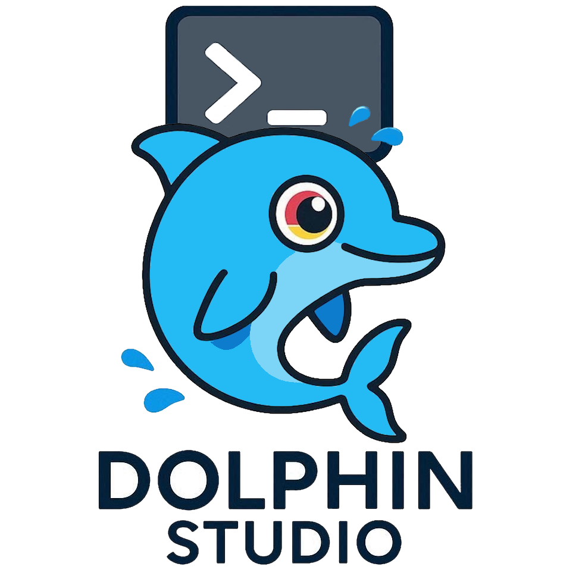
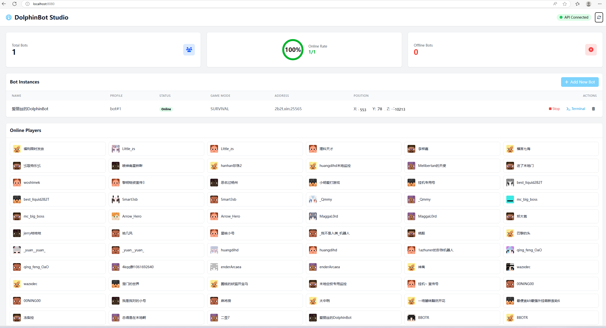

# DolphinStudio
DolphinStudio是一款MC机器人网页控制面板，用于集中管理和控制 DolphinBot MC 机器人。

<p align="center">

<br>
  <a href="https://github.com/NeonAngelThreads/DolphinStudio/releases">
    
  </a>
  <a href="https://github.com/NeonAngelThreads/DolphinStudio/releases">
        
  </a>
   <br>
   <a href="https://github.com/NeonAngelThreads/DolphinStudio/commits/master/">
      
   </a>
  
  <a href="https://github.com/NeonAngelThreads/DolphinStudio/issues">
    
  </a>
  <a href="https://github.com/NeonAngelThreads/DolphinStudio/tree/master/src/main">
     
  </a>
  <a href="https://app.codacy.com/gh/NeonAngelThreads/DolphinStudio/dashboard?utm_source=gh&utm_medium=referral&utm_content=&utm_campaign=Badge_grade">
     
  </a>
  <p align="center">
     <a href="https://github.com/NeonAngelThreads/DolphinStudio/issues">🐛提交开发建议/Bug报告</a>
</p> 


## 功能特性

### 1. 机器人管理
- [`查看所有机器人实例的实时状态`]
- [`显示机器人在线/离线状态、游戏模式、坐标位置`]
- [`支持一键启动/停止机器人`]
- [`自动刷新状态信息`]

### 2. Web 伪终端
- [`基于 Xterm.js 实现的完整终端交互体验`]
- [`支持 ANSI 彩色输出`]
- [`实时命令输入和响应`]
- [`WebSocket 全双工通信`]
- [`支持选择不同的机器人发送命令`]

### 3. 控制面板
- [`统计卡片展示总机器人数量、在线/离线数量`]
- [`响应式设计，支持桌面和移动设备`]
- [`现代化 UI 界面，操作直观`]

## 技术架构

### 后端
- **Spring Boot 3.2.0** - Web 框架
- **WebSocket** - 实时终端通信
- **OkHttp3** - 与 DolphinBot 核心 API 通信
- **Gson** - JSON 序列化/反序列化

### 前端
- **Tailwind CSS** - 样式框架
- **Xterm.js** - 终端组件
- **Font Awesome** - 图标库
- 原生 JavaScript，无需额外前端构建工具
## 快速开始

### 1. 启动 DolphinBot 核心客户端
下载DolphinBot最新版本构建，运行：

> [!IMPORTANT]
> 注意: **Java 版本 >= 17**

> [!NOTE]
> DolphinBot 于 1.4.0-Beta 才开始支持web控制面板，请下载版本 >= 1.4.0-Beta 的构建。
> 

API 服务将默认在端口 `25560` 启动。
```bash
java -jar DolphinBot-[version]-full.jar
```
DolphinBot ( >= 1.4.0-Beta) 在启动时会默认在25560端口开放 HTTP API 服务，如果你需要修改端口，则使用`--api`命令行定义：
```bash
java -jar DolphinBot-[version]-full.jar --api 27710
```

> [!IMPORTANT]
> 请注意: 如果你修改了DolphinBot API的端口，你也需要在DolphinStudio的spring服务端配置相同的端口：
> 
```properties
# DolphinBot API 地址
dolphinbot.api.url=http://localhost:27710/api
```

### 2. 启动 Web Dashboard

在release页面中下载Dolphin最新版本构建，运行：
```bash
java -jar DolphinStudio-[version].jar 
```
或者，在你的IDE中拉取代码，然后在 DolphinStudio 项目根目录下执行：

```bash
mvn spring-boot:run
```

Web 控制台将在 `http://localhost:8080` 启动。

### 3. 访问控制台
在浏览器打开 http://localhost:8080 即可使用。

## 配置说明

在 `src/main/resources/application.properties` 中可以修改配置：

```properties
# 服务端口
server.port=8080

# DolphinBot API 地址
dolphinbot.api.url=http://localhost:25560/api
dolphinbot.api.timeout=5000
```

> [!IMPORTANT] 系统要求
> - Java 17+
> - Maven 3.6+
> - DolphinBot 核心程序运行中并开启 API 服务

## API 接口

### DolphinBot 核心 API
原项目新增的 API 接口：


| 端点                     | 方法 | 描述       |
|------------------------|----------|----------|
| `/api/health`          | GET | 健康检查     |
| `/api/bots`            | GET | 列出所有机器人  |
| `/api/bots/start`      | POST | 启动机器人    |
| `/api/bots/stop`       | POST | 停止机器人    |
| `/api/bots/send-command` | POST | 向机器人发送命令 |
| `/api/config`          | GET/POST | 获取/更新配置  |
| `/api/bot/create`      |   POST       | 创建新机器人   |
| `/api/bot/delete`      |     POST         | 删除机器人       |


### Web Console API

| Endpoint | Description |
|-----------|-------------|
| `ws://localhost:25561` | 终端日志流和消息广播  |

- `GET /api/bots` - 获取机器人列表（代理到核心API）
- `POST /api/bots/{botName}/start` - 启动机器人
- `POST /api/bots/{botName}/stop` - 停止机器人
- `POST /api/bots/{botName}/command` - 发送命令
- `GET /api/bots/health` - 检查核心API可用性
- `WebSocket /ws/terminal` - 终端通信接口

## 目录结构

```
web-console/
├── src/
│   ├── main/
│   │   ├── java/
│   │   │   └── org/
│   │   │       └── angellock/
│   │   │           └── dolphinconsole/
│   │   │               ├── DolphinConsoleApplication.java  # 启动类
│   │   │               ├── config/
│   │   │               │   └── WebSocketConfig.java        # WebSocket配置
│   │   │               ├── controller/
│   │   │               │   └── BotController.java          # REST API控制器
│   │   │               ├── service/
│   │   │               │   └── DolphinBotApiService.java   # 核心API客户端
│   │   │               └── websocket/
│   │   │                   └── TerminalWebSocketHandler.java  # WebSocket处理器
│   │   └── resources/
│   │       ├── static/
│   │       │   └── index.html  # 前端页面
│   │       ├── application.properties  # 配置文件
│   │       └── templates/
│   └── test/
├── pom.xml  # Maven依赖配置
└── README.md
```

## 使用说明

1. **启动服务**：按照上面的步骤分别启动 DolphinBot 核心程序和 Web Console
2. **查看机器人状态**：打开网页即可看到所有机器人的实时状态
3. **查看玩家**：可看到所有在线玩家的名称和皮肤  
4. **使用终端**：
   - 在终端上方的下拉框选择需要操作的机器人
   - 直接在终端中输入命令，按回车发送
   - 终端支持彩色输出，与桌面终端体验一致
5. **管理机器人**：在机器人列表中可以点击启动/停止按钮控制机器人

## 注意事项
- 确保 DolphinBot 核心程序运行时添加 `--api` 参数开启 API 服务
- 第一次启动 Web Console 时 Maven 会自动下载依赖包
- 终端功能需要 WebSocket 连接，确保浏览器支持

## 社区
- 遇到bug了吗？欢迎提出问题和建议！  
  我的Bilibili空间：
  https://m.bilibili.com/space/386644641
- 如果你喜欢 DolphinBot，欢迎点一颗小小的 Star！

## 开源协议
GPL-3.0 或更高版本，请参阅[完整开源许可](LICENSE).

### **By NeonAngelThreads, coding with ❤️**